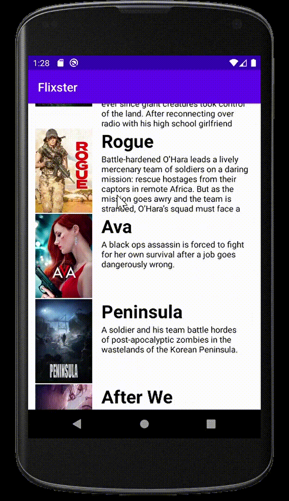

📝 `NOTE` Paste this template at the top of your existing `README.md` file from part 1 of this assignment. (🚫 Remove this paragraph after after checking off completed user stories)

## Flix Part 2

### User Stories

#### REQUIRED (10pts)

- [X] (8pts) Expose details of movie (ratings using RatingBar, popularity, and synopsis) in a separate activity.
- [X ] (2pts) Allow video posts to be played in full-screen using the YouTubePlayerView.

### App Walkthough GIF

 

### Notes

## Open-source libraries used
- [Android Async HTTP](https://github.com/codepath/CPAsyncHttpClient) - Simple asynchronous HTTP requests with JSON parsing
- [Glide](https://github.com/bumptech/glide) - Image loading and caching library for Android
